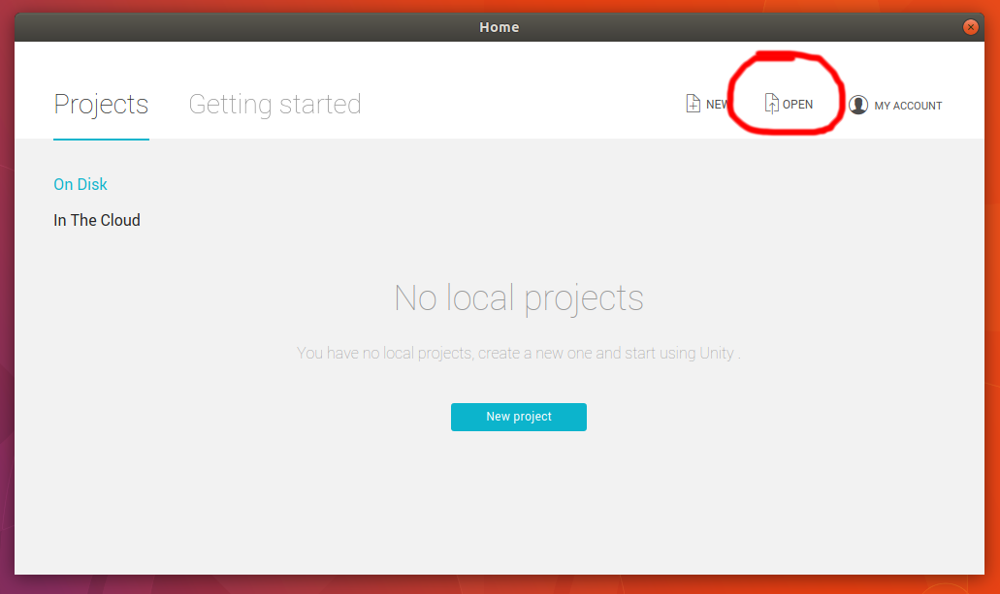
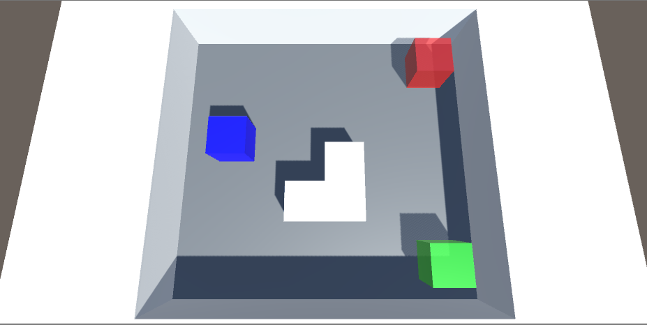
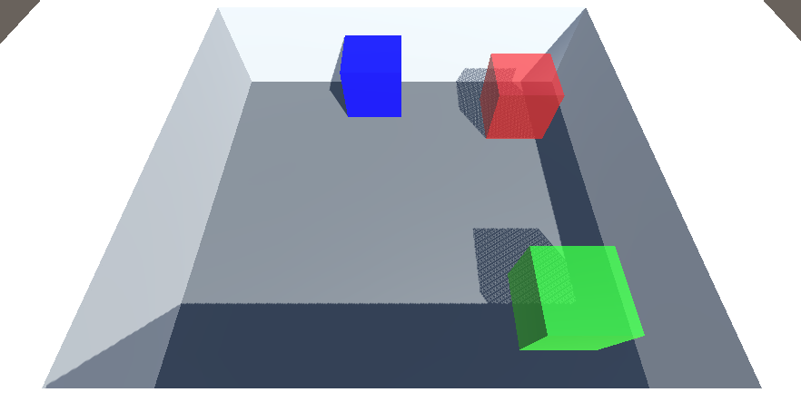
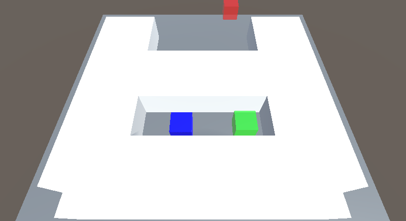

# Unity Qlearning Algorithm #

This is a rebuilt 3D version of the [Pygame Qlearning Algorithm](https://github.com/taylerallen6/PygameQLearningAlgorithm) using Unity Game Engine. All of the code has been converted from python to C#. Much of this article will look the same with a few differences.

This Q learning agent is built in Unity Game Engine. The Q learning agent code is kept seperate from the Unity environment code in the [UnityQlearner1/Assets/Scripts/QLearnerScript.cs](UnityQlearner1/Assets/Scripts/QLearnerScript.cs) file. This is the brain of the program. This is so the agent can be taken out of the Unity environment and used in other environments.

## Requiremnets: ##
- [Unity Game Engine - personal version (free)](https://store.unity.com/)
- files from this repository.

To run this code, first install [Unity Game Engine](https://store.unity.com/). Then clone or download this repository. Open Unity and click OPEN. This could open up your file manager. Location the files from this repository and click to open the
UnityQlearner1 folder into Unity.

(NOTE: UnityQlearner1 is the name of the project. If you already have a project with that name, change the name of that folder in your file manager before opening it in Unity.)

This should successfully open the UnityQlearner1 project in Unity Game Engine. For information on how to use Unity, refer to Unity's [tutorials](https://unity3d.com/learn/tutorials), [documentation](https://docs.unity3d.com/Manual/index.html), or [scripting documentation](https://docs.unity3d.com/ScriptReference/index.html).

## Environments: ##
This repository comes with a few different environments you can play with. These environments are located in the Assets/Scenes. 

## Qlearning Agent ##

The Q learning agent is a reinforcement learning agent that learns to achieve a goal through recieving a reward. In this example, the agent, represented as a blue cube, recieves a positive reward of 50 points for each time it makes it to the green cube and recieves a negative reward of -1 point for each move it makes. In some environments, there is also a red cube from which it recieves a negative reward of -50 points. It can only make 5 moves: up, down, left, right, or stay still. Once it makes it to the green or red cube, it restarts to its original position and tries again, each time getting closer to the optimal path.

(NOTE: It cannot "see" the green or red cube or its surroundings. It is only aware of its x and y coordinates and the reward it recieves.)

## Q Learning Algorithm ##

An detailed explanation of the Q learning algorithm can be found at [http://www.cse.unsw.edu.au/~cs9417ml/RL1/algorithms.html](http://www.cse.unsw.edu.au/~cs9417ml/RL1/algorithms.html) but here is short explaination from the article:

1. Initialize the Q-values table, Q(s, a).
2. Observe the current state, s.
3. Choose an action, a, for that state based on an action selection policies (this example uses a Greedy policy).
4. Take the action, and observe the reward, r, as well as the new state, s'.
5. Update the Q-value for the state using the following formula:

      Q(s, a) <-- Q(s, a) + alpha [r + y MAXa'Q(s', a) - Q(s, a)]
6. Set the state to the new state, and repeat the process until a terminal state is reached.
